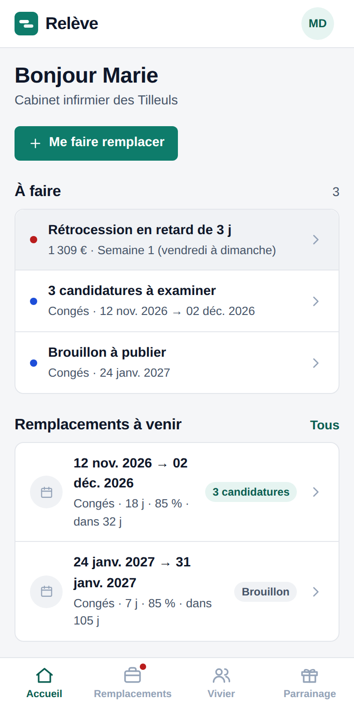
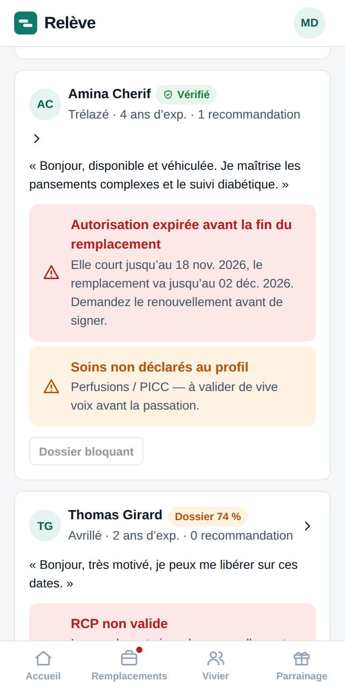
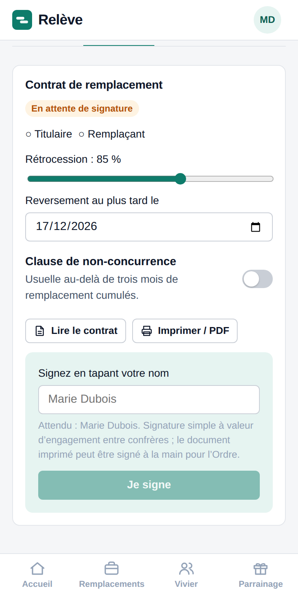

# Relève

**Trouver, sécuriser et suivre un remplaçant, pour les infirmiers libéraux.**

Un infirmier libéral n'a pas de congés payés : chaque jour sans remplaçant est un jour sans revenu et une patientèle laissée sans soins. Aujourd'hui, le remplacement se règle par petites annonces et bouche-à-oreille, puis par un contrat, une déclaration à l'Ordre et un reversement d'honoraires gérés à la main.

Relève outille tout ce parcours : annoncer une absence, recevoir des candidatures, **vérifier automatiquement** que le remplaçant peut légalement remplacer, générer le contrat, suivre le reversement des honoraires.

<table>
<tr>
<td align="center"><br><sub>Le cabinet voit ce qui attend un geste</sub></td>
<td align="center"><br><sub>Les candidatures sont contrôlées avant la signature</sub></td>
<td align="center"><br><sub>Le contrat se signe depuis le téléphone</sub></td>
</tr>
</table>

**Démonstration en ligne : <https://cabinetflow.fr>** (sans compte, données fictives).
Accès direct à la vue cabinet : `/?demo=cabinet` · à la vue remplaçant : `/?demo=remplacant`.

## Le produit en un coup d'œil

| | |
|---|---|
| **Utilisateurs** | Les cabinets infirmiers libéraux (titulaires) qui cherchent un remplaçant, et les infirmiers remplaçants |
| **Ce qui change** | De l'annonce au reversement, chaque étape est vérifiée ou suivie au lieu d'être gérée à la main |
| **Ce qui le distingue** | Contrôles bloquants avant la signature (autorisation valable jusqu'au dernier jour, assurance professionnelle, règle des deux remplacements simultanés), suivi du reversement jusqu'au paiement, recommandations impossibles sans contrat signé |
| **Modèle économique** | Abonnement pour le cabinet (hypothèse : 29 € par mois, essai de 14 jours sans carte) ; gratuit pour le remplaçant |
| **Stade** | Pré-lancement : démonstration en ligne, backend sécurisé prêt mais non activé, premiers retours d'infirmiers libéraux attendus |

## Où en est le projet

| Domaine | État |
|---|---|
| Démonstration complète (annonce, candidatures, contrôles, contrat, passation, reversement) | En ligne |
| Comptes réels, synchronisés entre appareils (Supabase) | Prêt, non activé en production |
| Isolation des données, chiffrement, droits RGPD | Implémentés et testés (225 assertions SQL) |
| Abonnement (Stripe) | Prêt en mode test, non branché |
| Signature du contrat | Signature simple ; signature électronique qualifiée à faire |
| Notifications par email et SMS | À faire |
| Vérification des pièces justificatives (aujourd'hui déclaratives) | À faire |
| Relecture juridique des conditions d'utilisation et du contrat | Brouillons à faire relire par un avocat |
| Validation des priorités auprès d'utilisateurs | Protocole défini ([détail](docs/tests-utilisateurs.md)), premiers retours attendus |

## Ce que le dépôt montre côté ingénierie

- **La sécurité est dans la base de données, pas dans l'interface** : isolation par cabinet imposée par Postgres (Row Level Security forcée sur toutes les tables, droits par colonne, règles métier rejouées côté serveur).
- **Tests** : 40 tests unitaires (Vitest) et 225 assertions SQL exécutées sur un Postgres jetable, dont une matrice d'isolation entre cabinets. Les migrations sont rejouées deux fois pour prouver qu'elles sont idempotentes.
- **Intégration continue** : lint, typage strict, tests, build, budget de taille du bundle, audit des dépendances, tests de base de données, typage des fonctions serveur, scan de secrets.
- **Données sensibles traitées dès la conception** : chiffrement des fiches de passation, journal d'accès, purge automatique, export et suppression en libre-service ([détail](docs/securite-et-donnees.md)).
- **Paiement** : abonnement Stripe via fonctions serveur (webhook signé et idempotent), en mode test.
- **Livraison simple** : application React/TypeScript produite en un seul fichier HTML ; production déployée à la main avec confirmation explicite.

Environ 4 300 lignes de TypeScript (11 écrans), 1 100 lignes de migrations SQL, 540 lignes de tests SQL.

## Démarrer en local

```bash
npm ci
npm run dev        # http://localhost:5173 — mode démonstration, aucune configuration
```

| Commande | Rôle |
|---|---|
| `npm run check` | Lint, types, tests unitaires, build (ce que fait la CI) |
| `npm test` | Tests unitaires : domaine, actions, synchronisation, logique de paiement |
| `npm run test:db` | Tests SQL sur un Postgres jetable : migrations ×2, jeu de données, isolation, règles métier, RGPD |
| `npm run build` | Produit `dist/index.html`, autonome |
| `bash scripts/og/generer.sh` | Régénère l'image d'aperçu des liens partagés (`public/og.png`) |

Le mode « comptes réels » s'active uniquement si `VITE_SUPABASE_URL` et `VITE_SUPABASE_ANON_KEY` sont définies au build (voir [`.env.example`](.env.example) et [l'exploitation](docs/exploitation.md)).

## Documentation

| Document | Contenu |
|---|---|
| [Produit](docs/produit.md) | Problème, solution, utilisateurs, déploiement par paliers, concurrence, risques |
| [Modèle économique](docs/modele-economique.md) | Marché, tarification, coût de revient par cabinet |
| [Architecture](docs/architecture.md) | Vue d'ensemble technique, modèle de données, règles tenues par le serveur |
| [Sécurité et données](docs/securite-et-donnees.md) | Décision sur les données de santé, RGPD, mesures en place |
| [Qualité](docs/qualite.md) | Tests, intégration continue, points d'attention, limites connues |
| [Exploitation](docs/exploitation.md) | Mise en ligne, variables et secrets, paiement, déploiement |
| [Avant la première vente](docs/avant-premiere-vente.md) | Prérequis à lever avant le premier client payant |
| [Décisions](docs/decisions.md) | Choix structurants et alternatives écartées |
| [Validation auprès d'utilisateurs](docs/tests-utilisateurs.md) | Protocole de recueil des priorités |

Les pages légales (mentions, confidentialité, conditions d'utilisation) sont dans [`legal/`](legal/) : ce sont des brouillons, affichés dans l'application.

## Avertissement

Version de démonstration : aucune donnée de patient ne doit y être saisie. Les montants de rétrocession sont des estimations, pas un calcul fiscal ; le contrat est un modèle de travail à relire, pas un conseil juridique.
