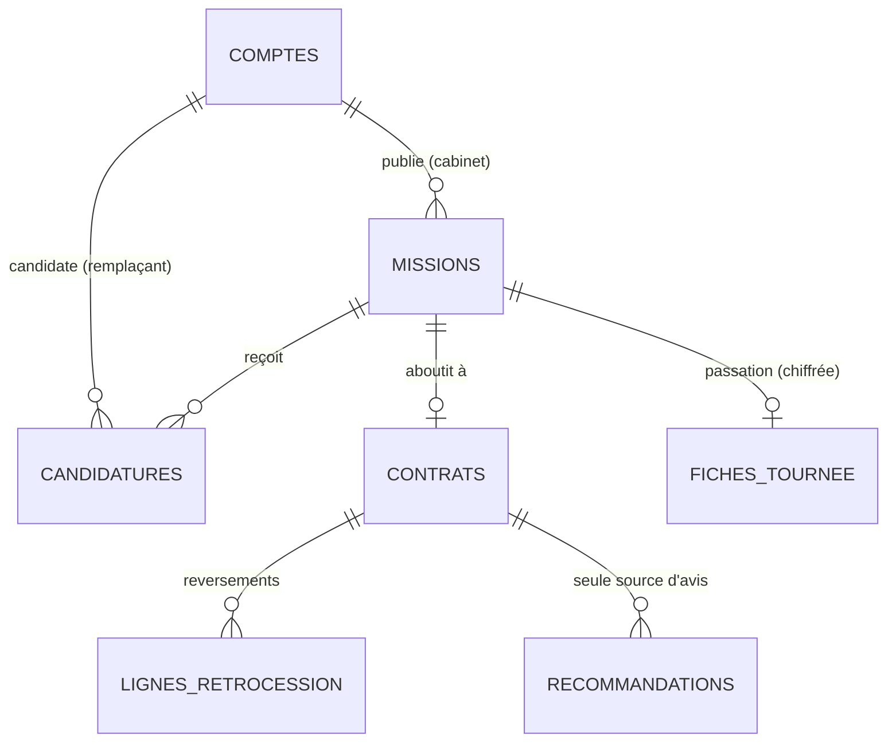

# Schéma de données (Supabase / Postgres)

Schéma en étoile autour de l'objet principal : **la mission** (un besoin de remplacement). Sources : `supabase/migrations/`.



Autour de **comptes** (le « tenant ») gravitent : `compte_membres` (qui peut agir pour ce compte), `pieces` (dossier de confiance), `invitations`, `badges`, `subscriptions` (Stripe).

## Tables

| Table | Rôle | Qui lit | Qui écrit |
|---|---|---|---|
| `comptes` | Un cabinet ou un remplaçant | Membres ; partenaires d'une candidature/d'un contrat. Les autres passent par `annuaire()` (sans email ni téléphone) | Membres (colonnes de profil seulement) ; création via `creer_compte()` |
| `compte_membres` | Lien utilisateur Auth ↔ compte (cabinet de groupe = plusieurs membres) | Membres du compte | Serveur |
| `pieces` | Autorisation, RCP, RPPS… | Titulaire du dossier ; cabinets en relation | Titulaire |
| **`missions`** | **Objet central** | Cabinet ; tous si publiée ; candidats ; retenu | Cabinet (publication soumise à l'abonnement) |
| `candidatures` | Remplaçant → mission | Remplaçant, cabinet de la mission | Remplaçant (création, message) ; cabinet (statut) |
| `contrats` | Contrat de remplacement | Les deux parties | Cabinet crée ; chacun signe pour soi ; figé après signature |
| `lignes_retrocession` | Suivi des reversements | Les deux parties | Cabinet |
| `recommandations` | Avis vérifiés | Tous les membres connectés | Une partie d'un contrat signé, une fois |
| `fiches_tournee` | Passation, **chiffrée** | Personne en direct ; `fiche_lire()` | `fiche_enregistrer()` (cabinet) |
| `invitations`, `badges` | Parrainage, gamification | Propriétaire | Propriétaire (création) ; activation par le serveur |
| `subscriptions`, `stripe_events` | Abonnement | Cabinet (lecture) | Webhook Stripe seulement |
| `audit_log` | Journal d'accès | Compte concerné | Serveur |
| `private.*` | Quotas, paramètres, fonctions internes | — | — |

## Règles tenues par le serveur (et pas seulement par l'écran)

| Règle | Où |
|---|---|
| Isolation stricte entre cabinets | RLS forcée partout + GRANT par colonne (`…0200_securite_rls.sql`) |
| Autorisation valable jusqu'au dernier jour, RCP en cours, 2 remplacements simultanés max | `private.controler_affectation`, rejoué à chaque signature |
| Chacun signe pour soi, date posée par le serveur, contrat figé après signature | `private.garde_contrat` |
| Seul un candidat peut être retenu ; une candidature naît « envoyée » | `private.garde_mission`, `private.garde_candidature` |
| Pas de faux avis | Politique `recos_insert` |
| Parrainage : 1 mois, plafond 12/an, à la 1re signature du filleul | `private.activer_parrainage` |
| Publication réservée aux cabinets en essai ou abonnés | `private.cabinet_actif` dans les politiques `missions_*` |
| Fiche visible du remplaçant de J-7 à J+3 seulement | `private.peut_lire_fiche` |

## Index

Toutes les clés étrangères utilisées en filtre RLS sont indexées (`cabinet_id`, `remplacant_id`, `mission_id`, `contrat_id`, `par_id`, `filleul_id`, `user_id`), plus `missions(statut, du)` pour la place de marché et `comptes(role, departement)` pour le vivier.

## Rejouer localement

```bash
npm run test:db                       # Postgres jetable : migrations ×2, seed, 225 assertions
supabase start && supabase db reset   # avec la CLI Supabase (Docker) : migrations + seed.sql
```
