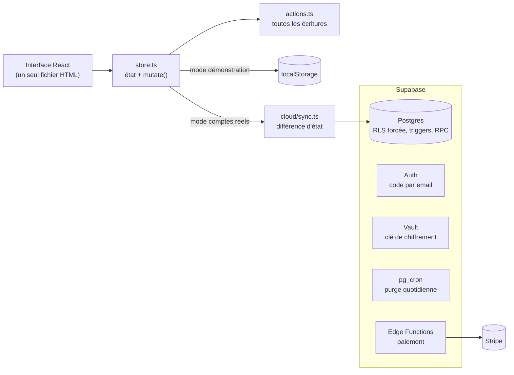
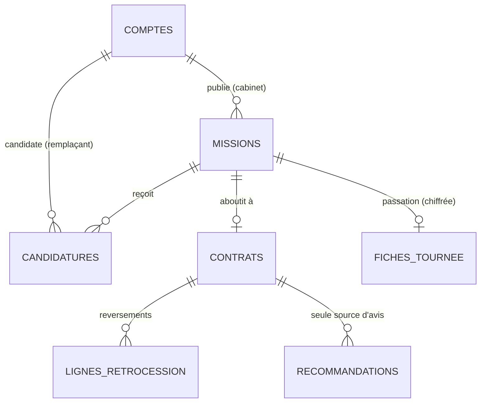

# Architecture

## Vue d'ensemble



Deux modes, choisis au moment du build :

| Mode | Activé si | Données |
|---|---|---|
| **Démonstration** (par défaut) | aucune variable d'environnement | Dans le navigateur (`localStorage`), monde fictif pré-chargé |
| **Comptes réels** | `VITE_SUPABASE_URL` et `VITE_SUPABASE_ANON_KEY` définies | Supabase, avec isolation par cabinet ; la démonstration reste accessible sans compte |

## Principes de conception

1. **La sécurité est dans la base, pas dans l'interface.** Row Level Security forcée sur toutes les tables, droits accordés colonne par colonne, déclencheurs « garde » pour les règles métier, fonctions `security definer` à `search_path` vide. Aucune règle importante ne repose sur l'écran.
2. **Un seul point d'écriture.** Toutes les écritures passent par `actions.ts` puis `mutate()` ; les écrans ne touchent jamais l'état directement. C'est ce qui a permis de brancher un backend sans réécrire les écrans.
3. **Les règles métier sont rejouées côté serveur.** Contrôles d'éligibilité à la signature, fenêtre d'accès à la fiche de passation, plafond de parrainage, accès à la publication selon l'abonnement.
4. **Migrations rejouables et testées** : appliquées deux fois de suite dans la CI pour prouver qu'elles sont idempotentes.
5. **Un seul fichier HTML** en sortie de build : déploiement trivial, budget de taille surveillé.

## Structure du code

```
src/
  lib/
    types.ts         modèle métier (vocabulaire des infirmiers libéraux)
    domain.ts        calculs : rétrocession, conformité des pièces, contrôles d'affectation
    gamification.ts  fiabilité, badges, « jours de repos sécurisés »
    contrat.ts       génération du contrat de remplacement
    store.ts         état et sélecteurs ; démonstration (localStorage) ou comptes réels (cache mémoire)
    actions.ts       toutes les écritures
    cloud/           Supabase : configuration, authentification, correspondance, synchronisation
    seed.ts          monde de démonstration
    router.ts        routage par hash
    annonce.ts       annonce d'absence partageable : données dans le lien, messages et adresses WhatsApp
    demoState.ts     état de la démonstration en blocs (offre essayée, notes, profil), dans le navigateur
    demoBlocs.ts     les cinq blocs : nom, niveau d'offre, message de retour
    demoFixtures.ts  personnes et dossier fictifs des blocs, contrôlés et rédigés par le vrai domaine
  screens/           un fichier par écran ; demo/ : une feuille de test par bloc
supabase/
  migrations/        schéma, sécurité, chiffrement et RGPD, abonnement (rejouables)
  functions/         Edge Functions de paiement (Deno)
  tests/             tests SQL : isolation entre cabinets, règles métier, RGPD
  seed.sql           données fictives
legal/               brouillons des pages légales, affichés dans l'application
```

## Modèle de données

Un schéma en étoile autour de l'objet principal : **la mission**, c'est-à-dire un besoin de remplacement.



Autour de `comptes` (le « tenant ») gravitent `compte_membres` (qui peut agir pour ce compte), `pieces` (dossier de confiance), `invitations`, `badges` et `subscriptions` (abonnement).

| Table | Rôle | Qui lit | Qui écrit |
|---|---|---|---|
| `comptes` | Un cabinet ou un remplaçant | Les membres ; les partenaires d'une candidature ou d'un contrat. Les autres passent par `annuaire()`, sans email ni téléphone | Les membres (colonnes de profil) ; création via `creer_compte()` |
| `compte_membres` | Lien utilisateur ↔ compte (un cabinet de groupe a plusieurs membres) | Les membres | Le serveur |
| `pieces` | Autorisation, assurance, numéro RPPS (identifiant national du professionnel)… | Le titulaire du dossier ; les cabinets en relation | Le titulaire |
| **`missions`** | **Objet central** | Le cabinet ; tous si publiée ; candidats ; remplaçant retenu | Le cabinet (publication soumise à l'abonnement) |
| `candidatures` | Remplaçant → mission | Le remplaçant, le cabinet de la mission | Le remplaçant (création, message) ; le cabinet (statut) |
| `contrats` | Contrat de remplacement | Les deux parties | Le cabinet le crée ; chacun signe pour soi ; figé après signature |
| `lignes_retrocession` | Suivi des reversements | Les deux parties | Le cabinet |
| `recommandations` | Avis vérifiés | Tous les membres connectés | Une partie d'un contrat signé, une fois |
| `fiches_tournee` | Passation, **chiffrée** | Personne en direct ; `fiche_lire()` | `fiche_enregistrer()` (cabinet) |
| `invitations`, `badges` | Parrainage, gamification | Le propriétaire | Le propriétaire (création) ; activation par le serveur |
| `subscriptions`, `stripe_events` | Abonnement | Le cabinet (lecture) | Le webhook de paiement uniquement |
| `audit_log` | Journal d'accès | Le compte concerné | Le serveur |
| `private.*` | Quotas, paramètres, fonctions internes | — | — |

### Règles tenues par le serveur

| Règle | Où |
|---|---|
| Isolation stricte entre cabinets | RLS forcée partout, droits par colonne |
| Autorisation valable jusqu'au dernier jour, assurance en cours, deux remplacements simultanés au plus | `private.controler_affectation`, rejoué à chaque signature |
| Chacun signe pour soi, date posée par le serveur, contrat figé après signature | `private.garde_contrat` |
| Seul un candidat peut être retenu ; une candidature naît « envoyée » | `private.garde_mission`, `private.garde_candidature` |
| Pas de faux avis | Politique `recos_insert` |
| Parrainage : un mois, plafond de 12 par an, à la première signature de l'invité | `private.activer_parrainage` |
| Publication réservée aux cabinets en essai ou abonnés | `private.cabinet_actif` dans les politiques de `missions` |
| Fiche visible du remplaçant de J-7 à J+3 seulement | `private.peut_lire_fiche` |

Toutes les clés étrangères utilisées dans les filtres de sécurité sont indexées, plus `missions(statut, du)` pour la place de marché et `comptes(role, departement)` pour le vivier.

## Démonstration en blocs

La page `DemoHub` présente cinq blocs ; chacun ouvre une feuille (`screens/demo/`) qui se joue seule. Trois choix structurent le code :

- **Le vrai domaine, pas une maquette.** Les contrôles d'éligibilité (`controlerAffectation`), le contrat (`texteContrat`), le calcul de rétrocession et l'alerte à l'Ordre sont ceux de l'application : ce que la démonstration montre est ce que le produit fait.
- **Une annonce sans serveur.** Dates, nom du cabinet, ville, motif et numéro facultatif sont encodés dans l'adresse (`#/annonce/<code>`) ; la page du remplaçant décode le lien et ouvre WhatsApp (`wa.me`) sur une réponse préécrite. Rien n'est stocké. Le lien peut être fabriqué par n'importe qui : le décodage valide chaque champ (longueurs, dates, numéro limité aux chiffres) et le texte n'est jamais interprété comme du HTML.
- **Un état local défensif.** Offre essayée, notes, profil et mot libre vivent dans `localStorage` (`releve:demo-blocs`), relus avec méfiance : tout ce qui n'a pas la bonne forme est écarté, et la démonstration fonctionne même si le stockage est bloqué. Rien ne quitte l'appareil avant un tap sur « Envoyer ».

Limites assumées : les réponses des remplaçants sont simulées (Relève ne voit pas les messages WhatsApp), et le bouton Retour du navigateur quitte la démonstration au lieu de fermer la feuille ouverte.

## Synchronisation par différence d'état

En mode comptes réels, l'interface continue d'écrire dans le store local ; `cloud/sync.ts` calcule la différence entre l'état avant et après chaque action et la traduit en requêtes Supabase (`cloud/mapping.ts`, testé sans réseau).

- **Avantage** : environ 300 lignes au lieu d'une API par action ; les écrans ne changent pas.
- **Compromis** : les écritures ne sont pas transactionnelles (retenir un candidat représente plusieurs requêtes). L'état est rechargé automatiquement après une erreur. Des fonctions transactionnelles pour « retenir » et « signer » sont envisagées si cela s'avère nécessaire ([points d'attention](qualite.md)).

## Paiement

Trois fonctions serveur (Deno) : création d'une session de paiement, accès au portail client, webhook. Le webhook vérifie la signature, est idempotent et relit l'abonnement chez le prestataire (l'ordre des événements n'est pas garanti). La table `subscriptions` n'est écrite que par lui ; le plan du compte s'en déduit. Une clé de production est refusée tant qu'un garde-fou explicite n'est pas posé. Mise en service : [Exploitation](exploitation.md).
